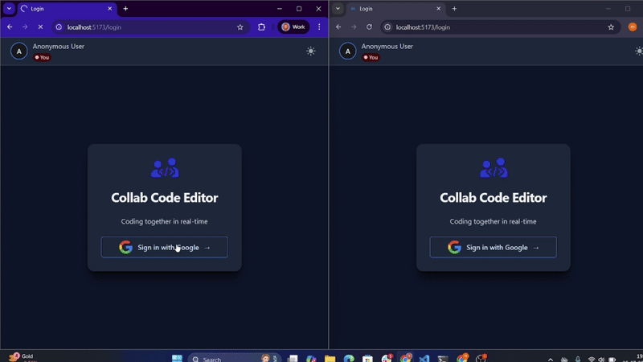
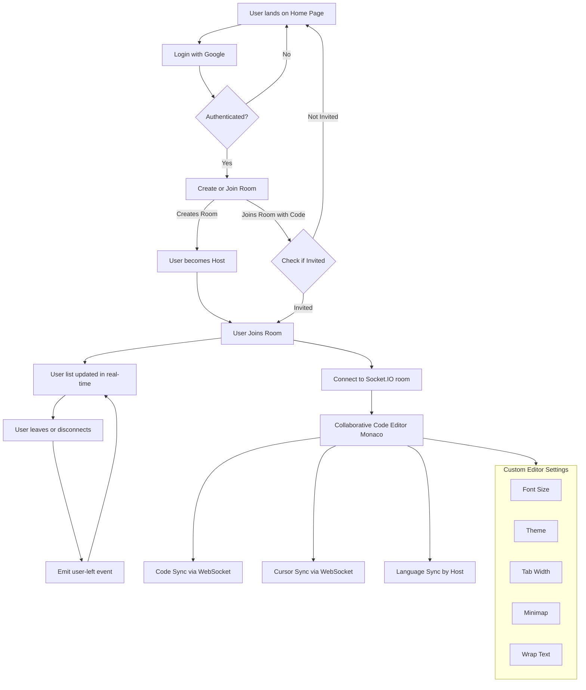
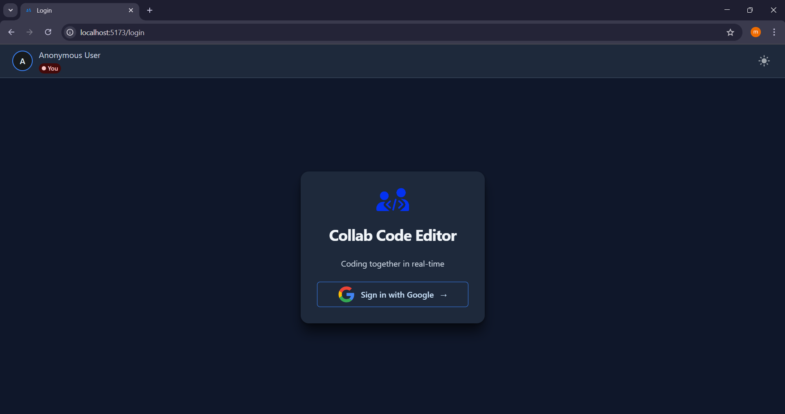
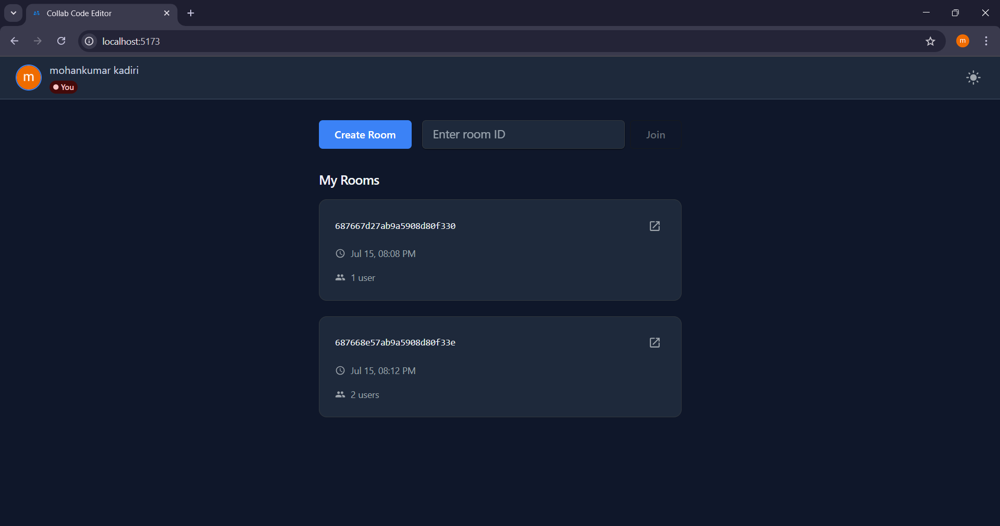
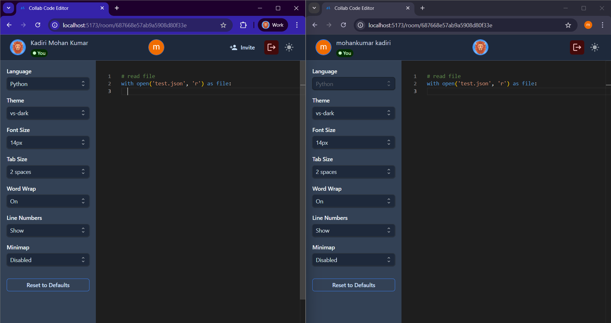
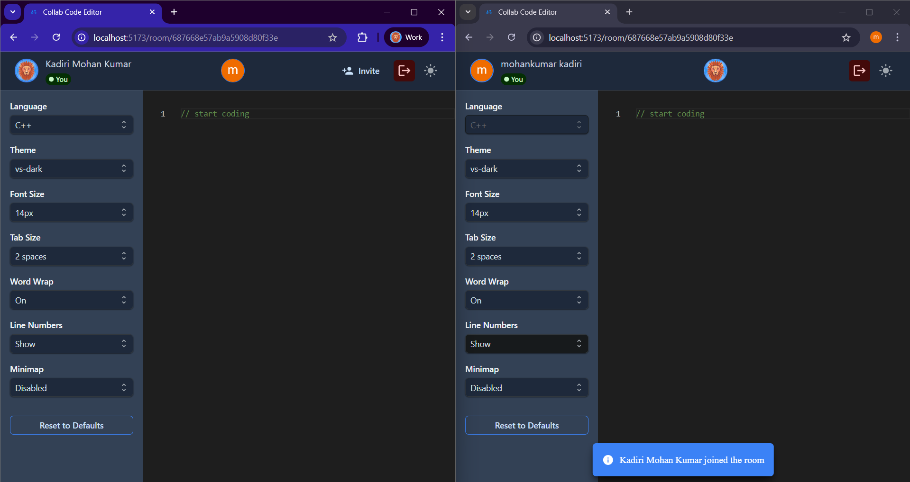

# Realtime Collaborative Code Editor

A full-stack real-time collaborative code editor where multiple users can write, edit, and view code simultaneously. The platform supports Google login, protected rooms, role-based access, and seamless collaboration with real-time code synchronization.

[CLICK HERE](demo/demo.mp4) to download and play the demo video locally.

  
  _Live collaborative editing demo_

## System Flow Chart


---

## MVP Features Completed

### Authentication & Authorization
- ✅ Google Sign-In using OAuth (Passport.js)
- ✅ Protected routes and session-based access
- ✅ Only invited users can access a room

### Room Management
- ✅ Create & join rooms with unique room codes
- ✅ Host can invite users to room
- ✅ Online user list with real-time join/leave notifications

### Collaborative Editor
- ✅ Monaco Editor (same as VS Code)
- ✅ Real-time code synchronization across all users
- ✅ Real-time cursor tracking with user identification
- ✅ Host-controlled language switching (synced across users)

### Editor Customization
Each user can personalize their editor:
- Font size
- Theme (dark/light)
- Tab spacing
- Word wrap
- Line numbers
- Minimap toggle

### Backend & Data Handling
- ✅ MongoDB for room, user, and session storage
- ✅ Redis for fast session caching and socket mapping

---

## Future Plans

Here are key enhancements planned for upcoming versions:

- **Code Execution Support**  
  Run user-submitted code for supported languages via a secure backend execution sandbox (Docker + child_process or remote compiler APIs).

- **Multi-file Editor Support**  
  Add option to manage and switch between multiple files (like an IDE).

- **Chat Panel Integration**  
  Realtime chat window for better team collaboration while coding.

- **Code History & Versioning**  
  Maintain snapshot history of code with undo/redo or full timeline playback.

- **Video/Audio Call Integration**  
  Integrate with WebRTC for seamless face-to-face collaboration.

- **File Uploads & Downloads**  
  Allow users to upload code files or export code as ZIP or individual files.

- **Code Linting & Formatting**  
  Integrate Prettier/ESLint support for inline formatting/linting suggestions.

- **AI Assistance (optional)**  
  Integrate AI-based code suggestions and auto-completions.

---

## Tech Stack

### Frontend
- React.js
- Redux Toolkit
- @mui/joy (Joy UI)
- @monaco-editor/react

### Backend
- Node.js + Express
- Socket.IO
- Passport.js (Google OAuth)
- Mongoose (MongoDB ODM)
- ioredis (Redis caching)

---

## Screenshots

- 
- 
- 
- 

---

## Getting Started

### 1. Clone the repository

```bash
git clone https://github.com/mohankumarkadiri/collab-code-editor.git
cd collab-code-editor
```

### 2. Install dependencies

#### Frontend

```bash
cd client
npm install
```

#### Backend

```bash
cd ../server
npm install
```

### 3. Set up environment variables

Create a `.env` file in the `server` folder and add the following:

```ini
SESSION_SECRET=your_secret_key
MONGO_USERNAME=your_mongo_user
MONGO_PASSWORD=your_mongo_password
MONGO_HOST=your_mongo_host
MONGO_DB_NAME=your_database_name
GOOGLE_CLIENT_ID=your_google_client_id
GOOGLE_CLIENT_SECRET=your_google_client_secret
UI_BASE_URL=http://localhost:5173
```

### 4. Start development servers

#### Start backend (server)

```bash
cd server
npm start
```

#### Start frontend (client)

```bash
cd client
npm start
```

Then open your browser at:  
**http://localhost:5173**

---

## License

MIT – feel free to fork, modify, and contribute!
